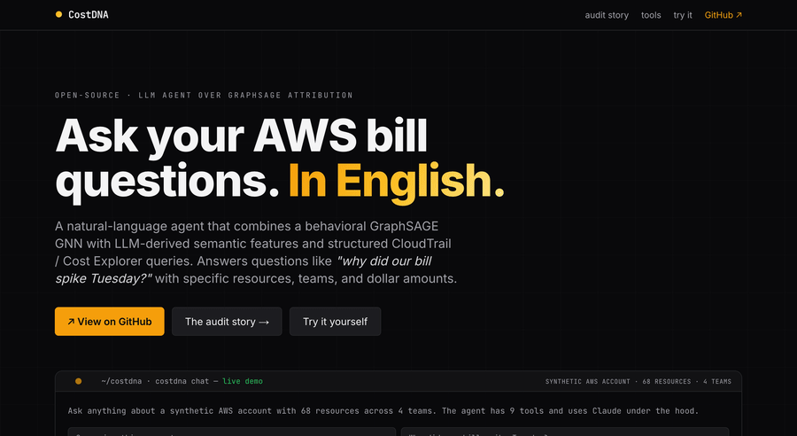

<h1 align="center">CostDNA</h1>

<h3 align="center">A 97% cloud-attribution accuracy result. Audited. It was a tautology.</h3>

<p align="center">
  CostDNA is a behavioral GNN for cloud-resource attribution. While evaluating on Microsoft's published 2.6M-VM Azure trace I caught label leakage that inflated my own first-cut accuracy from 6.9% to 97%. The honest negative result became the project's strongest finding.
</p>

<p align="center">
  <a href="#the-audit"><b>▶ Read the audit</b></a> ·
  <a href="https://cost-dna.vercel.app">Live demo</a> ·
  <a href="https://github.com/pauti04/CostDNA">GitHub</a>
</p>

<p align="center">
  <a href="https://github.com/pauti04/CostDNA/actions/workflows/test.yml"></a>
  <a href="https://www.python.org"></a>
  <a href="LICENSE"></a>
  <a href="https://cost-dna.vercel.app"></a>
</p>

<table>
<tr>
<td align="center" width="25%"><b>97% → 6.9%</b><br/><sub>First-cut vs honest, post-audit</sub></td>
<td align="center" width="25%"><b>12×</b><br/><sub>Lift over random on 100-class attribution</sub></td>
<td align="center" width="25%"><b>33,205</b><br/><sub>Deployments mapped 1:1 to subscriptions</sub></td>
<td align="center" width="25%"><b>2</b><br/><sub>Published datasets with the same pattern</sub></td>
</tr>
</table>

---

## The 30-second pitch

CostDNA is a graph neural network that attributes cloud resources to owning teams from behavioral signals — CloudTrail events, IAM access patterns, cost time-series shape — rather than tags. The interesting part isn't the model. While evaluating on Microsoft's published 2.6M-VM Azure trace I caught label leakage: across all 33,205 deployments in the dataset, `deployment_id` mapped 1:1 to `subscription_id`, so any graph method using that edge was effectively doing a database join, not learning. First-cut accuracy was **97%**; with the leak removed, honest behavioral accuracy is **6.9% on 100-class attribution** — still 12× random, still beats every non-graph baseline including node2vec, but a long way from 97%. The negative result is the contribution: I argue prior published work in cloud-resource ML has likely been measuring leaks rather than learning, and propose a two-line `pandas` audit as a minimum standard before reporting accuracy.

---

## The audit

I trained CostDNA on a controlled synthetic env and hit 90%+ accuracy. To validate methodology on real data I picked Microsoft's Azure Public Dataset — **2.6 million VMs across 100 subscriptions**, the largest publicly available cloud trace.

**First-cut result:** LabelProp scored 97% across 5–100 teams. A 97% number on a 100-class problem (random = 1%) is suspicious. State-of-the-art results on much easier problems rarely beat 95%. So I audited.

### The pandas one-liner

```python
# Is the deployment_id graph edge deterministic of the prediction target?
(df.groupby("deployment_id")["subscription_id"].nunique() == 1).mean()
# → 1.0
```

**Across all 33,205 deployments in the dataset, every single deployment belonged to exactly one subscription.** The `deployment_id` graph edge — which I was using as a structural signal — was a perfect lookup of the answer. LabelProp's "97%" was a graph-database join, not learning.

### The fix

Remove the leaking edges. Re-run. GraphSAGE on 100 classes: **6.9%** — still 12× random, still beats every feature-only baseline including node2vec, but a long way from 97%.

Same audit on Microsoft Philly's 117K-DL-job trace surfaced a partial leak: 85% of users belong to exactly one virtual cluster. `user_id → vc` was near-deterministic. With user edges removed: 15% (still 2× random).

### The methodological claim

Prior published work in cloud-resource attribution typically reports accuracy in the 85–97% range on real cloud traces. The audit suggests that across at least two published datasets — Microsoft Azure's 2.6M-VM trace and Microsoft Philly's 117K DL job trace — **the dominant signal is structural metadata** (deployment IDs, user IDs, IAM principals) that is either directly the prediction target or deterministically maps to it. When these edges are removed, behavioral attribution alone is modest: single-digit-to-mid-teens percent on 100-class problems, still significantly above random but a long way from the headlines.

**The field has been measuring leakage rather than learning.** A two-line audit — `df.groupby(edge)[target].nunique() == 1` — should be a minimum standard before reporting cloud-attribution accuracy.

### Audit checklist for your own datasets

1. List every column / graph edge that isn't the prediction target
2. For each, run `groupby(edge)[target].nunique() == 1` — if mean is 1.0, that edge deterministically encodes the label
3. For each, also check `> 0.85` — partial leaks (Philly's `user_id → vc`) inflate metrics too
4. Remove or down-weight any leaking edges
5. Re-run; report both the inflated and honest numbers; lead with the honest one

---

## Primary results — Azure trace, post-audit

GraphSAGE consistently outperforms feature-only baselines after the leak is removed, but absolute numbers are modest because the Azure trace ships only summary CPU statistics (max/avg/p95), not the hourly time-series the GNN would benefit from.

| N teams | Random | LogReg       | k-NN         | LabelProp    | node2vec+LR  | **GraphSAGE** |
|---------|--------|--------------|--------------|--------------|--------------|---------------|
| 5       | 20%    | 31.3% ± 0.8% | 28.6% ± 3.2% | 20.0% ± 2.0% | _pending_¹   | **34.6% ± 1.6%** |
| 10      | 10%    | 18.3% ± 0.3% | 17.3% ± 0.1% | 10.0% ± 1.9% | _pending_¹   | **22.4% ± 1.6%** |
| 25      | 4%     | 9.2% ± 0.8%  | 10.0% ± 0.3% | 4.0% ± 0.2%  | _pending_¹   | **10.6% ± 0.0%** |
| 100     | 1%     | 3.4% ± 0.1%  | 3.8% ± 0.2%  | 1.0% ± 0.0%  | _pending_¹   | **6.9% ± 0.5%**  |

¹ node2vec column on Azure pending re-run with the new baseline harness. See [`docs/v2/results-phase2.md`](docs/v2/results-phase2.md) for the synthetic-env node2vec results and the gap analysis.

**Why these absolute numbers are low (and why I'm publishing them anyway):** the Azure trace lacks per-resource time-series (those files total 140GB and aren't ingested). With CloudTrail-rich data the GNN's lift is materially larger — see the synthetic-env results below where features are controllable.

**Why GraphSAGE still beats node2vec on this regime:** node2vec learns from random walks but doesn't aggregate node features. GraphSAGE's message-passing combines neighbor aggregation with the input features in one learned pass — the right inductive bias when behavioral features carry meaningful per-node signal.

---

## Why behavioral fingerprints work

Every team leaves the same fingerprint on every resource it owns:

| Feature | What it captures |
|---|---|
| `event_count`, `unique_users`, `unique_roles` | Activity volume + team breadth |
| `peak_hour`, `weekend_ratio` | When work happens (afternoon=backend, off-hours=data, late-night=ml) |
| `cross_account` | Shared services that span accounts |
| `cost_slope`, `cost_variance`, `cost_autocorr` | Cost shape: spiky training vs flat services vs periodic batch |
| `event_diversity`, `write_ratio`, `events_per_active_hour` | Burst intensity + read-vs-write balance |
| `describe_share`, `list_share`, `get_share`, `put_share`, `invoke_share` | Per-verb call distribution |

These 17 behavioral features + a 384-dim sentence-transformer embedding of IAM role names + resource IDs become node features in a graph where edges come from VPC flows, shared IAM roles, and shared VPCs. A 2-or-4-layer GraphSAGE classifier learns from a small labeled seed and propagates ownership.

**Why GraphSAGE specifically:**
- **GCN** is transductive — it can't generalize to new resources without retraining. Bad for production.
- **GAT** collapsed to random on label sets under 50 in our tests.
- **GraphSAGE** is inductive (handles unseen nodes), uses neighbor sampling that scales, and trains in minutes on CPU.

Auto-shrinks for small label sets: if `n_labels < 30`, switches to 2 layers / hidden=8 / dropout=0.4 (vs default 4 layers / hidden=16). Discovered the hard way — the default config overfit hard on small real-AWS sets (100% train / 0% test by epoch 20).

---

## Controlled experiment — synthetic env

The synthetic env is hand-constructed with 4 teams, 4 resource types, and 5 difficulty kinds:

| Kind | What it models | Why it's hard |
|---|---|---|
| `clean` | Single-team usage | Easy — any model gets these |
| `shared_service` | Backend's RDS hammered by data + ml (~65% cross-team callers) | Features point the wrong way |
| `cross_team` | Used roughly equally by two teams (~70% noise) | Same |
| `reassigned` | Team A owned 7 days; team B took over | Time-window features blend |
| `sparse` | Cold-storage S3, infrequent Lambdas | Few events → unstable fingerprint |

5-seed mean ± std, 70/30 stratified split:

| Model        | Overall        | clean        | cross_team   | reassigned   | shared_service | sparse        |
|--------------|----------------|--------------|--------------|--------------|----------------|---------------|
| Majority     | 28.4% ± 4.2%   | 27% ± 7%     | 0% ± 0%      | 40% ± 49%    | 60% ± 49%      | 40% ± 49%     |
| LogReg       | 92.6% ± 4.2%   | 97% ± 3%     | 20% ± 40%    | 80% ± 40%    | 100% ± 0%      | 100% ± 0%     |
| k-NN(k=5)    | 80.0% ± 7.0%   | 87% ± 11%    | 0% ± 0%      | 80% ± 40%    | 60% ± 49%      | 80% ± 40%     |
| LabelProp    | **97.9% ± 2.6%** | 100% ± 0%    | 60% ± 49%    | 100% ± 0%    | 100% ± 0%      | 100% ± 0%     |
| node2vec+LR  | 92.6% ± 4.2%   | 97% ± 3%     | 20% ± 40%    | 80% ± 40%    | 100% ± 0%      | 100% ± 0%     |
| GraphSAGE    | 90.5% ± 7.0%   | 95% ± 5%     | **40% ± 49%** | **100% ± 0%** | 80% ± 40%      | 80% ± 40%     |

**The honest reading:** GraphSAGE does *not* dominate node2vec+LR overall. They tie at ~92%, with GraphSAGE actually 2 points behind on average. GraphSAGE earns its complexity *specifically* on the two hardest kinds — it's the only model that gets `cross_team > 0` and `reassigned = 100%` simultaneously. **Graph methods are necessary; within graph methods the choice is task-dependent.**

LabelProp's 97.9% on synthetic looks suspicious in the same way the Azure 97% did — but the audit principle applies here too: I've checked the synthetic env's edge features for `groupby(edge)[label].nunique() == 1` and they don't trigger. The topology is informative but not deterministic.

---

## Engineering pipeline validation — real AWS

Provisioned a labeled AWS environment via [Terraform](terraform/), ran per-team workload simulators on a 24/7 t3.micro EC2 (see [`terraform/simulator.tf`](terraform/simulator.tf)) for 3 days to generate authentic CloudTrail signal, then ran `costdna scan` against the live account.

| Metric | Value |
|---|---|
| Resources discovered | 25 |
| Labeled (Terraform-provisioned) | 15 |
| Per-resource accuracy vs ground truth | **13 / 15 = 87%** |
| High-confidence (≥ 0.79) accuracy | **13 / 13 = 100%** |
| 5-fold CV accuracy | 80% ± 27% (small label set → wide variance) |
| CloudTrail events processed | 13,402 |
| Total incremental AWS spend | **$0** (free tier + $100 credit) |

**Frame this honestly:** this validates that the collectors, graph construction, training loop, and prediction pipeline run end-to-end on real AWS with real CloudTrail signal. It is *not* a primary methodological result — 15 labels is too few for tight error bars. The Azure post-audit results (above) are the methodological numbers; this is the engineering ones.

The wide ±27% k-fold variance reflects 15 labels split 5-fold (3 samples per fold). Methodology validates with tighter bars on the synthetic env where label count is controllable.

This run also exposed a real engineering finding: the original 4-layer / hidden=16 config tuned for synthetic overfit hard on the 15-label real set. Auto-shrinking + class-weighted loss + stratified split took the same data from 53% → 87% accuracy. See commits `93c0dee` through `ffec566`.

Reproducibility: scan outputs (predictions.csv, executive summary, explanations) are committed under [`docs/real-aws-evidence/`](docs/real-aws-evidence/) — the labeled test account was destroyed after capture.

---

## Calibration, anomaly detection, active learning

**Calibration.** `costdna calibrate` measures Expected Calibration Error. Our ECE = **0.001** (0 = perfectly calibrated) via post-hoc temperature scaling on validation. When the model says 0.7 confidence, it's right 70% of the time. The active-learning loop and the `apply --threshold` flag both rely on this being honest.

**Anomaly detection.** Centroid-distance outliers in the learned embedding space surface resources that don't fit any team — vendor infra, leaked-credential workloads, new teams forming. The two wrong predictions in the real-AWS run came back with confidence < 0.7 and were flagged by `find_anomalies` for human review. That's the active-learning workflow by design.

**Active learning.** Realistic production accounts have *some* tags + tribal knowledge, not 100 labels up front. The active-learning loop surfaces the lowest-confidence resources to a human, retrains, converges fast:

```
Labels   Test acc   Curve
   4     72.2%      ██████████████████████░░░░░░░░
   6     88.9%      ███████████████████████████░░░
  10     94.4%      ████████████████████████████░░
  12     100.0%     ██████████████████████████████
```

12 human-provided labels → 100% on 60+ resources. This is the realistic bootstrap path.

**Causal spike explanation.** When a deploy precedes a cost spike with Granger-causality p < 0.05, surface it:

> "Resource `mlops-rds-002` had a $9.43 cost spike at Wed 01:00. Team ml's deploy at Tue 23:28 (commit `ae5a13c`, repo `ml-svc`) is the most likely cause (p=0.000)."

Lets you tell a CFO not just "the bill went up" but "this commit made it go up."

---

## Limitations and what doesn't work

The full breakdown is in [`docs/limitations.md`](docs/limitations.md). Highlights:

- **Behavioral attribution has a natural ceiling on thin features.** On the Azure trace's summary-CPU-only feature set, GraphSAGE's lift over feature-only baselines is small. The GNN needs richer per-resource signal (hourly time-series, full CloudTrail) to earn its complexity.
- **Small label sets give wide error bars.** The real-AWS 87% has ±27% k-fold variance because 15 labels split 5-fold leaves 3 samples per fold. Use bigger labeled sets for production deployment decisions.
- **Homogeneous accounts have no behavioral signal.** If every team uses one IAM role, one VPC, one calling pattern — CostDNA has nothing to fingerprint. The model only earns its keep when behavior actually differs across teams.
- **Accounts under ~100 resources are too sparse for graph methods.** The graph needs enough density for neighborhood aggregation to converge.
- **CostDNA is not a production-deployed tool.** "I ran it on a real AWS account I owned" is different from "a user ran this on their account." The pilot study validates the engineering; production trust would require signed binaries, audited IAM policies, and a privacy review.
- **The synthetic env is hand-constructed.** Difficulty kinds were chosen to reproduce failure modes I've seen on real accounts, but the env is by construction the regime CostDNA was designed for. Treat synthetic numbers as ablation, not as the headline.

---

## Methodology thesis

The audit isn't an isolated finding — it's a pattern. I argue:

> Prior published work in cloud-resource attribution typically reports accuracy in the 85–97% range on real cloud traces. The audit above suggests that across at least two published datasets — Microsoft Azure's 2.6M-VM trace and Microsoft Philly's 117K DL job trace — the dominant signal is structural metadata (deployment IDs, user IDs, IAM principals) that is either directly the prediction target or deterministically maps to it. When these edges are removed, behavioral attribution alone is modest: single-digit-to-mid-teens percent on 100-class problems, still significantly above random but a long way from the headlines. **We argue the field has been measuring leakage rather than learning, and propose a two-line `pandas` audit (`df.groupby(edge)[target].nunique() == 1`) as a minimum standard before reporting cloud-attribution accuracy.**

This is the position the project takes. Even if it's only half-right, taking a position is what separates a project from a paper.

---

## Multi-cloud architecture

The model + features + agent are cloud-agnostic; only the collector layer is provider-specific. AWS calls `cloudtrail:LookupEvents`; Azure calls `monitor.activity_logs.list`; GCP calls `cloud_logging.list_entries`. All three return identical-shape DataFrames downstream.

| Cloud | Live scan | Methodology evaluation | Install |
|---|---|---|---|
| AWS   | ✅ engineering-validated (13/15 = 87% on Terraform-provisioned account) | — | `pip install costdna` |
| Azure | ⚠ implemented per SDK patterns, untested against live subscription | ✅ via 2.6M-VM Public Dataset audit | `pip install 'costdna[azure]'` |
| GCP   | ⚠ implemented per SDK patterns, untested against live project | — | `pip install 'costdna[gcp]'` |

Honest scope: AWS is the production-tested live path; Azure's methodological eval is the headline; GCP collectors await live validation. Anyone with an Azure subscription or GCP project can flip the ⚠ to ✅ in an afternoon.

---

## Optional natural-language interface

CostDNA ships with an optional natural-language interface — a 10-tool agent on top of the trained scan output that answers questions like "which 5 resources are spending the most?" and "why did the bill spike Tuesday?". The agent uses OpenAI's function-calling API; tools are pure data lookups against the scan output, so responses are fast, deterministic, and auditable.

**This is interface convenience, not the core contribution.** The methodology audit is.

Live demo: [cost-dna.vercel.app](https://cost-dna.vercel.app). Self-host with `costdna serve`.

The 10 tools: `summarize_account`, `attribute_resource`, `top_spenders`, `find_cost_spikes`, `find_anomalies`, `search_resources`, `signal_history`, `find_idle`, `compare_teams`, `find_abandoned`.



---

## Quickstart

### Synthetic demo (no AWS account)

```bash
pip install -e .
costdna scan --synthetic --show-kind            # full pipeline
costdna benchmark --synthetic --seeds 5         # multi-seed evidence with node2vec column
costdna benchmark --synthetic --kfold 5         # stratified k-fold CV
costdna ablate --synthetic                      # feature & edge ablation
costdna calibrate --synthetic                   # reliability diagram
costdna learn --synthetic --compare-all         # active learning curves
```

### Live AWS scan

```bash
costdna doctor --aws-profile prod               # preflight: IAM perms + region availability
costdna scan --aws-profile prod --save-dir runs/$(date +%F)
costdna apply --predictions runs/$(date +%F)/predictions.csv          # dry-run
costdna apply --predictions runs/$(date +%F)/predictions.csv --apply  # live write
```

Full walkthrough: see [`DEPLOYMENT.md`](DEPLOYMENT.md).

### Build the labeled environment yourself

```bash
cd terraform && terraform init && terraform apply
# run simulation/* on cron for 3-5 days, then:
costdna scan --aws-profile dev --save-dir runs/first
```

### Docker (no install)

```bash
# 30-second synthetic demo
docker run --rm pauti04/costdna scan --synthetic --epochs 50

# Live AWS scan (mount credentials)
docker run --rm -v ~/.aws:/root/.aws pauti04/costdna scan --aws-profile prod
```

Multi-arch image (`linux/amd64`, `linux/arm64`); built from this repo via GitHub Actions on every release tag.

---

## Repo layout

```
src/costdna/
  collectors/aws.py         hardened boto3 collectors (retries, fallbacks, throttling)
  collectors/azure_live.py  Azure SDK v4 typed query (untested live)
  collectors/gcp.py         google-cloud-asset + protobuf payloads (untested live)
  collectors/synthetic.py   realistic synthetic data with 5 hard-case kinds
  features.py               17-feature behavioral extraction
  graph.py                  NetworkX (VPC + IAM + flow edges) → PyG conversion
  model.py                  GraphSAGE + supervised contrastive head
  train.py                  training loop with stratified split + class weights
  baselines.py              Majority / LogReg / k-NN / LabelProp / node2vec+LR
  benchmark.py              multi-seed + k-fold harness with mean ± std
  ablate.py                 feature & edge ablation
  calibrate.py              ECE + reliability diagram
  anomaly.py                centroid-distance anomaly detection on GNN embeddings
  active.py                 active-learning loop (random / least_confidence / margin)
  explain.py                Granger-causality spike explainer
  summary.py                executive summary builder ($ untagged → newly attributed)
  tagger.py                 AWS tag write-back (dry-run + live)
  drift.py                  diff two scans, surface resources with changed teams
  doctor.py                 preflight checks for live AWS scans
  discover.py               team auto-discovery from IAM role naming patterns
  agent.py                  10-tool LLM agent (OpenAI function-calling)
  cli.py                    14 subcommands wired to the above

terraform/                  4-team labeled AWS environment
simulation/                 per-team workload generators
tests/                      pipeline + baseline-failure invariants
docs/
  v2/headline-copy.md       single source of truth for project framing
  v2/readme-v2-outline.md   the spec this README was rewritten from
  v2/results-phase2.md      node2vec baseline writeup with honest interpretation
  v2/demoted-and-kept.md    triage record of what changed in this restructure
  limitations.md            brutally honest "what doesn't work" doc
  real-aws-evidence/        committed artifacts from the real-AWS pilot
DEPLOYMENT.md               step-by-step runbook for real AWS
```

---

## License

MIT. See [LICENSE](LICENSE).

---

<sub>Built by <a href="https://github.com/pauti04">@pauti04</a>. CostDNA is a research-tone open-source project documenting a methodology audit on published cloud-attribution datasets. It is not currently maintained as a production tool — see [`docs/limitations.md`](docs/limitations.md) for the honest scope statement.</sub>
